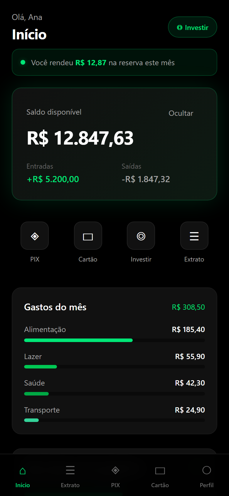
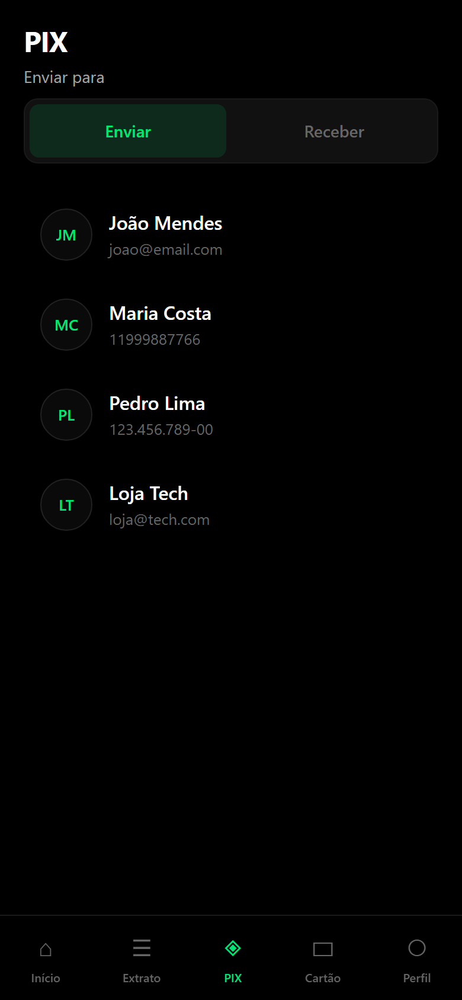
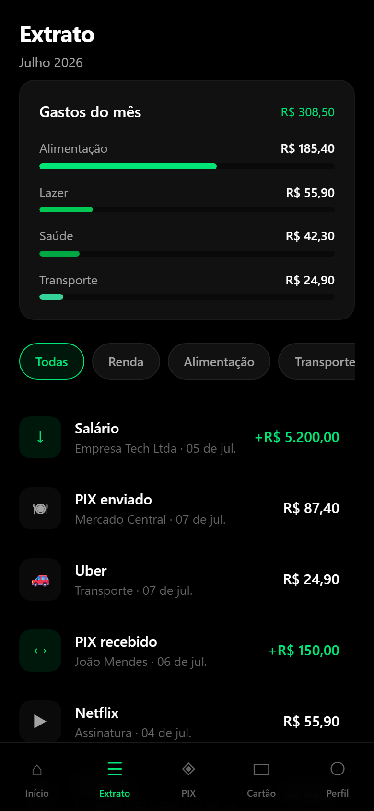
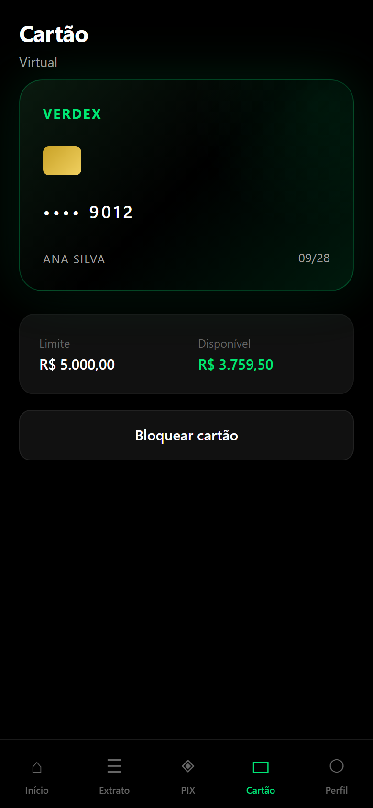
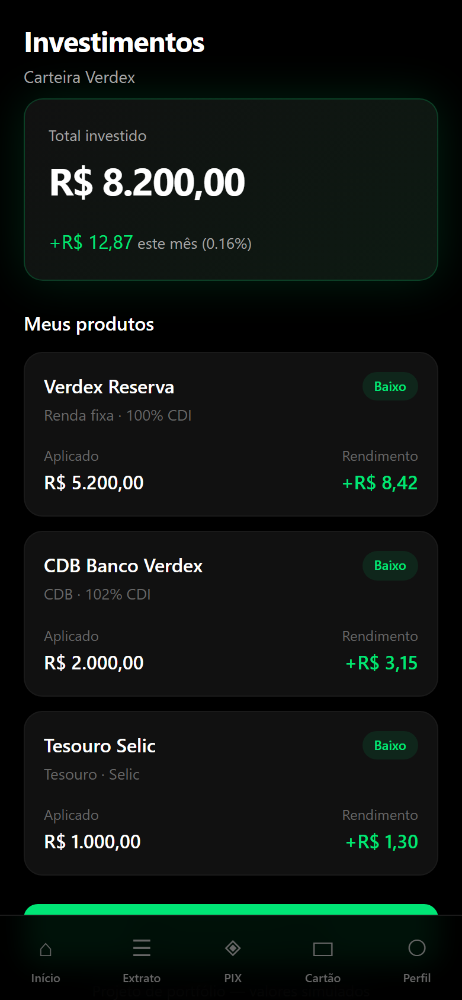

# Verdex

Banco digital minimalista — projeto de portfólio front-end com UI inspirada em fintechs.

**Paleta:** preto + verde (`#00E676`)

## Links

| | URL |
|---|---|
| **Demo ao vivo** | [fintech-app-nine-tan.vercel.app](https://fintech-app-nine-tan.vercel.app) |
| **Repositório** | [github.com/luandersonlemos/verdex](https://github.com/luandersonlemos/verdex) |

## Preview

<p align="center">
  
  
  
</p>

<p align="center">
  
  
</p>

## Visão do produto

Simulação de banco digital focada em **experiência de usuário** e **interface mobile-first**.  
Todas as telas usam dados mockados — ideal para demonstrar layout, fluxo e componentes em processos seletivos e freelas de front-end.

## Funcionalidades

| Módulo | Descrição |
|--------|-----------|
| **Splash & Login** | Entrada com animação e login mock |
| **Home** | Saldo, atalhos rápidos, gráfico de gastos e meta financeira |
| **Extrato** | Lista com filtros, resumo visual e detalhe da transação |
| **PIX** | Envio, QR Code para receber e copiar chave |
| **Investimentos** | Carteira e produtos simulados |
| **Cartão virtual** | Bloqueio e desbloqueio do cartão |
| **Perfil** | Dados do usuário e configurações |

## Rodar localmente

```bash
git clone https://github.com/luandersonlemos/verdex.git
cd verdex
npm install
npm run dev
```

Abre em [http://localhost:5174](http://localhost:5174)

## Deploy

Cada push na `main` faz deploy automático na Vercel.

```bash
npm run build
```

## Stack

| Camada | Tecnologia |
|--------|------------|
| UI | React 19 |
| Build | Vite 6 |
| Rotas | React Router 7 |
| Estilo | CSS custom (design system próprio) |
| Deploy | Vercel |

## Estrutura do projeto

```
src/
├── pages/          # Telas (Home, PIX, Extrato, etc.)
├── components/     # Componentes reutilizáveis
├── layouts/        # Layout principal do app
└── lib/            # Dados mock, formatação e utilitários
```

## Autor

Desenvolvido por **Luanderson** — projeto de portfólio front-end.
